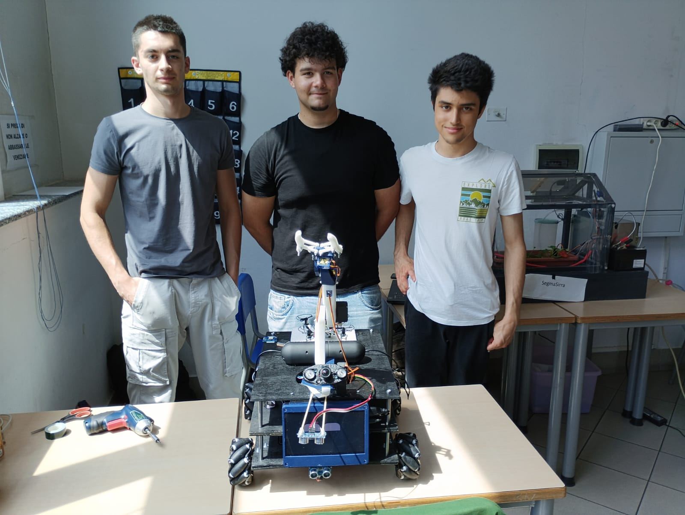

# L.A.G.M.A. B.I.L.L.S.
**L**and **A**nd **G**round-to-**M**idair **A**gent — **B**uilt for **I**ntelligent **L**inked **L**ocal **S**upport


<p align="center">
  
</p>

A Mecanum-wheeled robot for civil protection, powered by a Raspberry Pi orchestrating two custom ESP32 PCBs, sensors, a robotic arm, and a drone companion over MQTT. It navigates autonomously, maps its environment, avoids obstacles, and is controlled via voice AI, a MAUI app, or browser dashboard.

Presentato ad Arduino Day 2025.

## Team
- **palleBus** — firmware, software, PCB, integrazione di sistema
- **Simone Panelli** — componenti AI
- **Andrei Corduneanu** — modellazione 3D, falegnameria

## Repositories

| Repo | Contenuto |
|---|---|
| `lagmabills` (questo) | Firmware ESP32, codice Python Raspberry Pi, PCB (KiCad), modelli 3D |
| [`lagmabills-app`](https://github.com/Dragonyx118/LagmaIpp) | App companion LagmaIpp (.NET MAUI, Windows + Android) |
| [`lagmabills-web`](https://github.com/Dragonyx118/LagmaBills-Web) | Sito web del progetto |

## Struttura del repository

```
lagmabills/
├── firmware/
│   ├── firm_esp32_motori/     # Firmware PCBmotori (PlatformIO)
│   └── firm_esp32_sensori/    # Firmware PCBsensori (PlatformIO)
├── raspberry/
│   ├── odometria.py           # Odometria encoder Mecanum
│   ├── occupancyGrid.py       # Mappatura locale log-odds
│   ├── navigator.py           # Navigazione autonoma Potential Field
│   ├── GPS.py                 # Lettura NEO-6M → MQTT
│   ├── myViewerServer.py      # Dashboard web (HTTP + WebSocket + Leaflet)
│   ├── rasp_cam/              # Streaming camera OV5647
│   ├── odo_module/            # Moduli navigazione/mappatura aggiuntivi
│   └── Bamberg/
│       ├── ESP-IDF/           # Firmware ESP-Drone (ESP-IDF)
│       └── firm_drone/        # Bridge MQTT ↔ CRTP/UDP drone + test
├── AI_Bepo/                   # Server AI vocale (wakeword, STT, LLM, TTS)
├── AmazingArm/                # Modelli e risorse braccio robotico
├── PCB/
│   ├── PCBmotori/             # KiCad — ESP32 motori (4-layer)
│   ├── PCBsensori/            # KiCad — ESP32 sensori
│   └── PCBalim/               # KiCad — distribuzione alimentazione
├── Hardware/                  # Datasheet, pinout, power budget, BOM
├── models_3d/                 # Modelli 3D stampabili
└── docs/
    ├── img/                   # Foto e video dimostrativi
    └── LAGMABILLS.pptx        # Presentazione progetto
```

## Hardware

| Componente | Descrizione |
|---|---|
| Raspberry Pi 4B (4GB) | Cervello centrale, broker MQTT, Tailscale VPN |
| PCBmotori (ESP32, 4-layer) | 4× JGA25-370 Mecanum + encoder, 2× TB6612FNG, I2C slave 0x08 |
| PCBsensori (ESP32) | 6× HC-SR04, MPU-6050, 3× TCRT5000, PCA9685 → braccio 6DOF, I2C slave 0x09 |
| PCBalim | Distribuzione alimentazione custom, 2× LiPo 3S 5500mAh |
| ESP-Drone (ESP32-S2) | Ricognizione aerea, CRTP/UDP |
| OV5647 CSI | Camera RPi, stream MJPEG |
| ReSpeaker 2-Mic HAT | WM8960, wakeword ONNX, DOA GCC-PHAT |
| NEO-6M GPS | Tracciamento posizione world frame |
| Display 7" HDMI | Faccia animata responsiva (RPi) |
| Speaker Bluetooth | Audio stereo, musica / sirene / TTS |

Dettagli completi in [`Hardware/BOM.xlsx`](Hardware/BOM.xlsx) e [`Hardware/pinoutEsp32.xlsx`](Hardware/pinoutEsp32.xlsx).

## Architettura software

Tutto comunica via MQTT (Mosquitto su RPi, `localhost:1883`, accessibile anche via Tailscale).

```
              ┌─────────────────────────┐
              │  Mosquitto Broker (RPi) │
              └────────────┬────────────┘
     ┌──────────┬──────────┼──────────┬──────────┐
     │          │          │          │          │
odometria   occupancy   navigator  drone_bridge  GPS
     │        grid.py      .py        .py       .py
     │          │
  robot/     robot/
 motori/     mappa/
 stato       grid
```

| Topic | Direzione | Descrizione |
|---|---|---|
| `robot/motori/cmd` | Pi → ESP32 | Comandi movimento |
| `robot/motori/stato` | ESP32 → Pi | Encoder + PWM |
| `robot/sensori/distanze` | ESP32 → Pi | Distanze HC-SR04 (cm) |
| `robot/sensori/imu` | ESP32 → Pi | Accelerometro + giroscopio |
| `robot/odometria` | Pi → tutti | Posa X, Y, θ |
| `robot/mappa/grid` | Pi → viewer | Occupancy grid JSON |
| `robot/cliff/stato` | Pi → tutti | Stato sensori cliff |
| `robot/nav/cmd` | app → Pi | start / stop / reset_goal |
| `robot/nav/goal` | app → Pi | Goal `{x, y}` in world frame |
| `drone/cmd/rpyt` | app → Pi | Roll, pitch, yaw, thrust |

## Installazione (Raspberry Pi)

```bash
# Dipendenze Python
pip install paho-mqtt numpy sounddevice onnxruntime websockets \
            flask flask-socketio pyserial pynmea2 faster-whisper psutil

# Mosquitto broker
sudo apt install mosquitto mosquitto-clients
sudo systemctl enable mosquitto

# Driver ReSpeaker 2-Mic HAT
# Seguire istruzioni in Hardware/ o repo seeed-voicecard

# Avviare i moduli (esempio)
python3 raspberry/odometria.py &
python3 raspberry/occupancyGrid.py &
python3 raspberry/navigator.py &
python3 raspberry/GPS.py &
python3 raspberry/myViewerServer.py &
```

Dashboard web: `http://<ip-pi>:8080`

## Firmware ESP32 (PlatformIO)

Le cartelle in `firmware/` sono progetti PlatformIO completi e pronti da compilare (`pio run`).

Librerie richieste (`platformio.ini`):
- PubSubClient
- ArduinoJson
- MPU6050_light
- Adafruit PWM Servo Driver
- Preferences

Le credenziali WiFi e broker MQTT vengono salvate in NVS e possono essere aggiornate via I2C dal Pi senza reflashare.

📦 **Non vuoi compilare tu stesso?** Scarica le cartelle sorgente aggiornate automaticamente ad ogni modifica dalla sezione [Releases](../../releases).

## Pipeline AI vocale

```
ReSpeaker mic → wakeword ("hey nova") → DOA GCC-PHAT (stima direzione)
    → WebSocket stream PCM16 raw
    → Whisper STT → LLM (Ollama) → Piper TTS (voce "Miro" italiano)
    → audio risposta → Speaker Bluetooth
```

## Demo

**Primi test di movimento**

https://github.com/Dragonyx118/LagmaBills/raw/main/docs/img/first_test_move.mp4

**Prototipo in movimento**

https://github.com/Dragonyx118/LagmaBills/raw/main/docs/img/proto_move.mp4

**Test braccio robotico**

https://github.com/Dragonyx118/LagmaBills/raw/main/docs/img/test_arm.mp4

**Struttura in legno**

https://github.com/Dragonyx118/LagmaBills/raw/main/docs/img/wood_body.mp4

> GitHub riproduce automaticamente i link diretti `.mp4` di un repository quando incollati su una riga propria nel README, mostrando un player inline.

## Licenza

[Hippocratic License 3.0](LICENSE) (HL3-CL-ECO-LAW-MIL-SV) — © 2025 Dragonyx